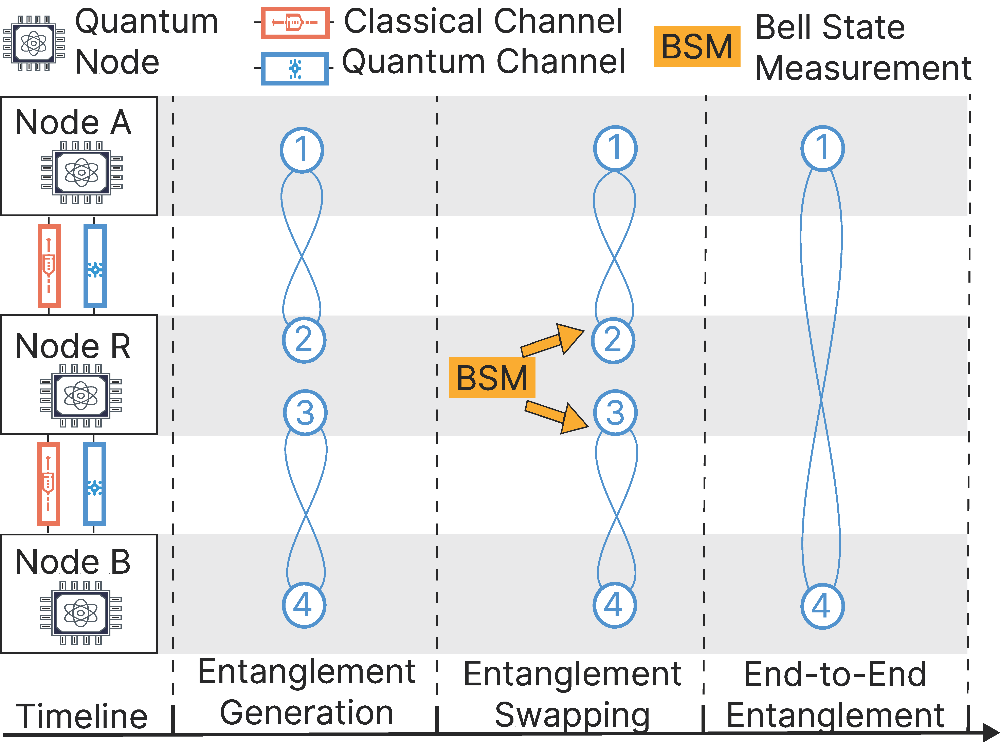
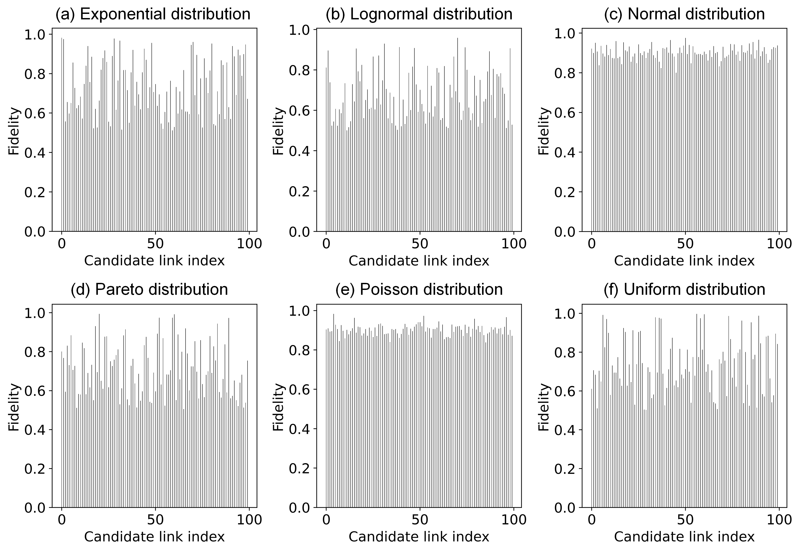
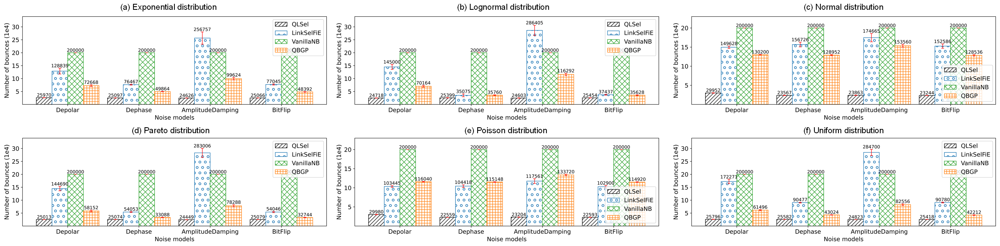
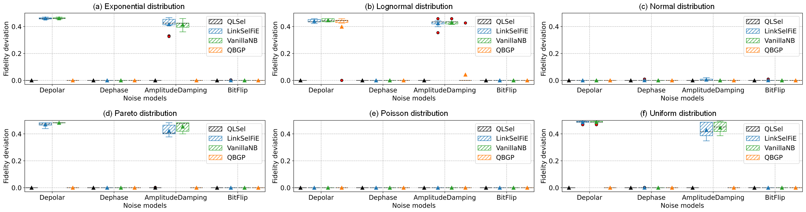

### QLSel: Demonstrating Efficient High-Fidelity Link Selection for Quantum Networks in the Wild



## Introduction

QLSel is an efficient selection algorithm for the high-fidelity link in the wild without assumptions about the fidelity distribution. We design the tailored link exploration strategy and link selection probability based on the coefficient of variation and Thompson sampling, to cope with the exploration-exploitation trade-off dilemma in the Multi-Armed Bandit (MAB) problem (for problem modeling). The demonstration video is available online https://youtu.be/46fg2M-mW74.

## Requirements

```bash
pip install scipy
pip install numpy
pip install pandas
pip install matplotlib
pip install sklearn
pip install netsquid
```

## Quantum Network Benchmarking

A series of codes for building quantum nodes and quantum networks are stored in ./code/network.py. 
The protocol interaction process of the quantum network benchmark is stored in ./code/nb_protocol.py. 
And ./code/nb_protocol.py includes codes about noise models and components. 

## Candidate Quantum Links

The candidate quantum link fidelity data are stored in the ./code/gene_path/ folder, including six generated distributions and one real-world fidelity set from IBMQ devices. 

## Various Configurations

The ./code/gene_all.py file can be used to generate quantum network data in each fidelity set, based on four different noise models. 
The ./code/qnet_data/ folder contains corresponding execution an measurement data for exponential distribution based on four noise models. 

## Running

To perform link selection code (QLSel and baselines), enter the ./code/ folder, run with
```bash
python all_alg.py
```

## Evaluation

To conduct a comprehensive assessment, we employ six distinct distributions to characterize the link fidelity, including exponential, lognormal, normal, pareto, poisson, and uniform distributions. 



We evaluate the link selection of these six distinct fidelity distributions, each fidelity distribution including 100 candidate links. 
The experiment results for the number of bounces and the fidelity deviation are shown in the figure below. 






### References
- [LINKSELFIE: Link Selection and Fidelity Estimation in Quantum Networks](https://liumaoli.me/assets/files/infocom2024_linkselfie.pdf), Maoli Liu, Zhuohua Li, Xuchuang Wang, John CS Lui - INFOCOM 2024
- [Quantum BGP with Online Path Selection via Network Benchmarking](https://liumaoli.me/assets/files/infocom2024_quantum_bgp.pdf), Maoli Liu, Zhuohua Li, Kechao Cai, Jonathan Allcock, Shengyu Zhang, JC Lui - INFOCOM 2024
- [A benchmarking procedure for quantum networks](https://www.nature.com/articles/s41534-022-00628-x), Jonas Helsen, Stephanie Wehner - npj Quantum Information 2023
- [Netsquid, a network simulator for quantum information using discrete events](https://www.nature.com/articles/s41534-022-00628-x), Tim Coopmans, Robert Knegjens, Axel Dahlberg, David Maier, and others - Communications Physics 2021
